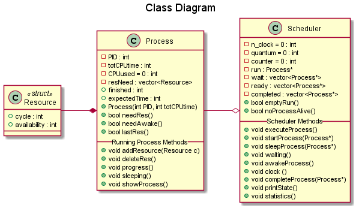

<!-- PROJECT LOGO -->
     

  
  <h1 align="center">Short Time Scheduler</h1>
  

    C++ implementation of a console program representing a simplified scheduler to which assign processes in a monoprocessor system.
  

  
  <!-- TABLE OF CONTENTS -->
  ## Table of Contents
  
  - [Table of Contents](#table-of-contents)
  - [About The Project](#about-the-project)
    - [How it Works](#how-it-works)
  - [Getting Started](#getting-started)
  - [UML Diagrams](#uml-diagrams)
    - [Class Diagram](#class-diagram) 
      - [Resource Struct](#resource-struct)
      - [Process Class](#process-class)
      - [Scheduler Class](#scheduler-class) 
  - [License](#license)
  - [Contributors](#contributors)

## About The Project

**Short Time Scheduler** is a scheduler simplified simulator to which assign processes in a monoprocessor system.
The advancement of the entire system occurs through steps and is simulated by sending the scheduler a "Clock" message generated from an application input.

### How it Works

The application evolution cycle is the following:

    <create process p1>
    <create process p2>
    ...
    foreach <process>
        scheduler.<process execute>
        do {
            scheduler.clock()
            <awakeAnyProcess?>
            process_sleep? ...
            process_need_input? ...
            scheduler.printState()
        } while <no more process alive>

At the end, for each process are shown a series of statistics relating the execution time of the system and of each process.

<!-- GETTING STARTED -->

## Getting Started

You can just clone this repository and run the "main.cpp" in "Sources" folder to "create" new processes and to simulate the evolution of the entire system. It is possible to edit the file to add more processes (default is 6) and edit the resources given to every process. Every resource has a different cycle and availability values which can cbe changed, and the user can also add or remove some.

Once the program starts, the user is asked to set a new "quantum CPU's time".  This value is set using parametrized values to configure the system in order to balance the number of processes in the various execution states.

<!-- UML DIAGRAMS  -->    
## UML Diagrams
      
### Class Diagram 

#### Resource Struct
This struct is composed by 2 integer values: the first value represents the exact moment the process needs a resource (the number of cycle for which it needs is), the second the waiting time for the resource to be used again. Here is shown an example:
    
    The resources are: (8,30) (5,25) (6,30). 
    After 8 clock's cycles the process is using that resource it will need a new one (that will be available after 30 clock's cycles), then it will need again a resource after 5 clock's cycles (that will be available after 25 clock's cycles), then again after 6 cycles and so on... 

#### Process Class
* PID is the Process IDentifier
* totCPUtime represents the number of execution steps to complete the process
* CPUused represents the steps already executed
* resNeed is a list containing Resource objects
* progress() method is activated at every execution step of the process
* needRes() method return true if the process needs a resource

#### Scheduler Class
* run is a reference to the process which is actually been executed
* wait is a list of references to processes waiting for a resource
* ready is a list of references to processes waiting their turn to be executed
* getRun(), getWait() and getReady() return the value of their relative attribute
* printState() show the actual state of the attributes
* startProcess() takes a reference to a process which is put in che the ready list
* clock represents the advancement of a step. this means it manage a process running. The process can advance and use a resource, finisch its execution, or been put in the wait or ready list (the first if it run out of resource, the second if the quantum CPU's time is passed). If the process exits the run state a new process must be taken from the tail of the ready list (FIFO logic).
* the quantum CPU's time chosen by the user is the same for every process and is equal to n clock's cycles

<!-- LICENSE -->

## LICENSE

Distributed under the GPL License. See `LICENSE` for more information.

<!-- CONTRIBUTORS -->

## CONTRIBUTORS

[Daniele Pellegrini](https://github.com/danielepelleg) - 285240
